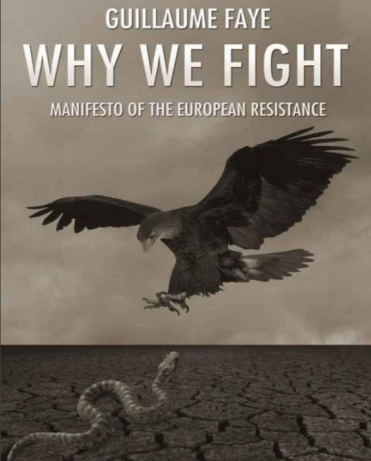

# Por que lutamos 

> **Manifesto da Resistência Europeia**

> Guillaume Faye

Faz um diagnóstico da situação atual e propõe um programa de resistência, reconquista e regeneração. Ele oferece a perspectiva de uma alternativa racial e revolucionária para a atual civilização decadente. O principal objetivo do manifesto é, portanto, unificar a resistência desenvolvendo uma doutrina comum que una todos e todas as tendências buscando constituir uma rede europeia de resistência - uma doutrina que vai além das velhas querelas sectárias e divisões superficiais. Todos os assuntos relevantes, incluindo política, economia, geopolítica, demografia e biologia são abordados. Como foi para a esquerda do século XIX com o Manifesto Comunista de Marx, Por que lutamos está destinado a se tornar a obra-chave para os identitários do século XXI. Esta edição de Por que lutamos contém o texto completo da edição original francesa, bem como material adicional que foi adicionado para a edição alemã. Também está incluído um prefácio original do tradutor Michael O'Meara, autor de New Culture, New Right, bem como um prefácio do Dr. Pierre Krebs, presidente do Thule-Seminar na Alemanha. Instituto de Ciência Política, o ensaísta Guillaume Faye foi um dos principais teóricos da Nouvelle Droite francesa nas décadas de 1970 e 1980, antes de sua crescente simpatia pelo movimento identitário. Ele também foi jornalista da Figaro-Magazine, Paris-Match, Magazine-Hebdo, Valeurs Actuelles e comentarista de rádio. Por vários anos, ele foi o editor do J'ai tout compris (Eu entendi tudo), um boletim privado. Também está incluído um prefácio original do tradutor Michael O'Meara, autor de New Culture, New Right, bem como um prefácio do Dr. Pierre Krebs, presidente do Thule-Seminar na Alemanha. 

Instituto de Ciência Política, o ensaísta Guillaume Faye foi um dos principais teóricos da Nouvelle Droite francesa nas décadas de 1970 e 1980, antes de sua crescente simpatia pelo movimento identitário. Ele também foi jornalista da Figaro-Magazine, Paris-Match, Magazine-Hebdo, Valeurs Actuelles e comentarista de rádio. Por vários anos, ele foi o editor do J'ai tout compris (Eu entendi tudo), um boletim privado. Também está incluído um prefácio original do tradutor Michael O'Meara, autor de New Culture, New Right, bem como um prefácio do Dr. Pierre Krebs, presidente do Thule-Seminar na Alemanha. Instituto de Ciência Política, o ensaísta Guillaume Faye foi um dos principais teóricos da Nouvelle Droite francesa nas décadas de 1970 e 1980, antes de sua crescente simpatia pelo movimento identitário. Ele também foi jornalista da Figaro-Magazine, Paris-Match, Magazine-Hebdo, Valeurs Actuelles e comentarista de rádio. Por vários anos, ele foi o editor do J'ai tout compris (Eu entendi tudo), um boletim privado. 

Com doutorado em ciência política pelo Instituto de Ciência Política de Paris, o ensaísta Guillaume Faye foi um dos principais teóricos da Nouvelle Droite francesa nas décadas de 1970 e 1980, antes de sua crescente simpatia pelo movimento identitário. Ele também foi jornalista da Figaro-Magazine, Paris-Match, Magazine-Hebdo, Valeurs Actuelles e comentarista de rádio. Por vários anos, ele foi o editor do J'ai tout compris (Eu entendi tudo), um boletim privado. Com doutorado em ciência política pelo Instituto de Ciência Política de Paris, o ensaísta Guillaume Faye foi um dos principais teóricos da Nouvelle Droite francesa nas décadas de 1970 e 1980, antes de sua crescente simpatia pelo movimento identitário. Ele também foi jornalista da Figaro-Magazine, Paris-Match, Magazine-Hebdo, Valeurs Actuelles e comentarista de rádio. Por vários anos, ele foi o editor do J'ai tout compris (Eu entendi tudo), um boletim privado. Valeurs Actuelles e comentarista de rádio. Por vários anos, ele foi o editor do J'ai tout compris (Eu entendi tudo), um boletim privado. Valeurs Actuelles e comentarista de rádio. Por vários anos, ele foi o editor do J'ai tout compris (Eu entendi tudo), um boletim privado.